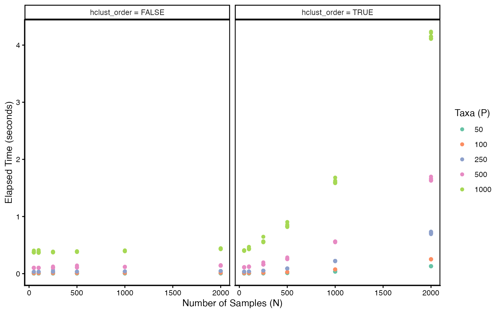

# Comparing Runtime across Sample Sizes and Number of Taxa

## Introduction

This vignette studies how phylobar’s runtime scales with the number of
samples (N) and taxa (P). We simulate random data across a grid of (N,
P) values and time each call with
[`system.time()`](https://rdrr.io/r/base/system.time.html). We also
compare runtime with and without ordering samples with hierarchical
clustering (the `hclust_order` argument).

``` r

library(ape)
library(ggplot2)
library(phylobar)
theme_set(theme_classic())
set.seed(20260209)
```

## Setup

We simulate one large dataset at the maximum grid dimensions and subset
it for each (N, P) combination. This avoids repeated simulation and
naming boilerplate inside the timing loops.

``` r

n_eval <- c(50, 100, 250, 500, 1000, 2000)
p_eval <- c(50, 100, 250, 500, 1000)
n_reps <- 10

grid <- expand.grid(
    N = n_eval,
    P = p_eval,
    hclust_order = c(TRUE, FALSE),
    rep = seq_len(n_reps)
)
```

``` r

tree_full <- rtree(max(p_eval))
x_full <- matrix(
    rpois(max(n_eval) * max(p_eval), lambda = 5),
    nrow = max(n_eval), ncol = max(p_eval)
)
colnames(x_full) <- tree_full$tip.label
rownames(x_full) <- paste0("s", seq_len(max(n_eval)))

trees <- list()
for (p in p_eval) {
    tips <- tree_full$tip.label[seq_len(p)]
    trees[[as.character(p)]] <- drop.tip(
        tree_full, setdiff(tree_full$tip.label, tips)
    )
}
```

## Timing

For each (N, P, hclust_order) combination we subset the pre-simulated
data and time
[`phylobar()`](http://mkdiro-o.github.io/phylobar/reference/phylobar.md).
By default `phylobar` sorts samples using hierarchical clustering, which
can be costly when the number of samples is large. It is also often
unnecessary when there is already a natural sample ordering (e.g., over
time). Setting `hclust_order = FALSE` keeps samples in their input
order.

``` r

results <- grid
results$elapsed <- NA

for (i in seq_len(nrow(results))) {
    tree <- trees[[as.character(results$P[i])]]
    x <- x_full[seq_len(results$N[i]), tree$tip.label]

    tm <- system.time(
        phylobar(x, tree, hclust_order = results$hclust_order[i])
    )
    results$elapsed[i] <- tm["elapsed"]
}
```

## Results

``` r

results$P <- factor(results$P)
results$hclust_label <- ifelse(
    results$hclust_order,
    "hclust_order = TRUE",
    "hclust_order = FALSE"
)

ggplot(results, aes(N, elapsed, color = P)) +
    geom_point() +
    scale_color_brewer(palette = "Set2") +
    facet_wrap(~ hclust_label) +
    theme(panel.border = element_rect(fill = NA, linewidth = 0.9)) +
    labs(
        x = "Number of Samples (N)",
        y = "Elapsed Time (seconds)",
        color = "Taxa (P)"
    )
```



## Visualization

Here is an example of the phylobar visualization made with $`N = 2000`$
samples and $`P = 1000`$ taxa. While `phylobar` generates the plot SVG
elements in a few seconds, the output is both difficult both for the
browser to render interactively and for us to visually interperet. We’ve
disabled this plot in this documentation because it consumes quite a lot
of browser memory drawing all the bars in the barplot.

``` r

# very slow rendering, not recommended
phylobar(x, tree, hclust_order = results$hclust_order[i])
```

In this regime, we recommend using the `subset_cluster` function to
select representative samples to include in the stacked bar plot.
Alternatively, separate phylobar views can be made for different sample
subsets. As long as we reduce $`N`$, we can keep $`P = 1000`$ and still
have smooth interaction.

``` r

x_sub <- subset_cluster(x, k = 100)
x_sub <- x_sub[, colSums(x_sub) > 0]
phylobar(x_sub, tree, hclust_order = results$hclust_order[i])
```

## Takeaways

1.  Bypassing the hierarchical clustering step helps in the large $`N`$
    and $`P`$ setting. When the data are large, it may be worth using a
    custom, more scalable seriation algorithm to sort the rows of `x` in
    advance, and then set `hclust_order = FALSE`.

2.  While the `phylobar` function executes quickly, rendering and visual
    interpretation both suffer when $`N`$ is large. When $`N`$ and $`P`$
    are large, the initial view will show $`N \times P`$ rectangles in
    the stacked barplot. Rendering all rectangles as SVG elements in the
    browser can be slow, and stacked bar plots with too many bars are
    illegible. We recommend either finding representative samples or
    breaking the exploration into separate subsets of samples.

## Session Info

``` r

sessionInfo()
#> R version 4.5.2 (2025-10-31)
#> Platform: aarch64-apple-darwin20
#> Running under: macOS Sequoia 15.7.4
#> 
#> Matrix products: default
#> BLAS:   /System/Library/Frameworks/Accelerate.framework/Versions/A/Frameworks/vecLib.framework/Versions/A/libBLAS.dylib 
#> LAPACK: /Library/Frameworks/R.framework/Versions/4.5-arm64/Resources/lib/libRlapack.dylib;  LAPACK version 3.12.1
#> 
#> locale:
#> [1] en_US.UTF-8/en_US.UTF-8/en_US.UTF-8/C/en_US.UTF-8/en_US.UTF-8
#> 
#> time zone: America/Chicago
#> tzcode source: internal
#> 
#> attached base packages:
#> [1] stats     graphics  grDevices utils     datasets  methods   base     
#> 
#> other attached packages:
#> [1] phylobar_0.99.10 ggplot2_4.0.2    ape_5.8-1        BiocStyle_2.38.0
#> 
#> loaded via a namespace (and not attached):
#>  [1] sass_0.4.10         generics_0.1.4      lattice_0.22-9     
#>  [4] digest_0.6.39       magrittr_2.0.5      evaluate_1.0.5     
#>  [7] grid_4.5.2          RColorBrewer_1.1-3  bookdown_0.46      
#> [10] fastmap_1.2.0       jsonlite_2.0.0      Matrix_1.7-5       
#> [13] BiocManager_1.30.27 purrr_1.2.2         scales_1.4.0       
#> [16] codetools_0.2-20    textshaping_1.0.5   jquerylib_0.1.4    
#> [19] cli_3.6.6           rlang_1.2.0         withr_3.0.2        
#> [22] cachem_1.1.0        yaml_2.3.12         otel_0.2.0         
#> [25] tools_4.5.2         parallel_4.5.2      dplyr_1.2.0        
#> [28] fastmatch_1.1-8     vctrs_0.7.3         R6_2.6.1           
#> [31] lifecycle_1.0.5     fs_2.1.0            htmlwidgets_1.6.4  
#> [34] ragg_1.5.2          cluster_2.1.8.2     pkgconfig_2.0.3    
#> [37] desc_1.4.3          pkgdown_2.2.0       bslib_0.10.0       
#> [40] pillar_1.11.1       gtable_0.3.6        glue_1.8.1         
#> [43] phangorn_2.12.1     Rcpp_1.1.1-1.1      systemfonts_1.3.2  
#> [46] xfun_0.57           tibble_3.3.1        tidyselect_1.2.1   
#> [49] knitr_1.51          dichromat_2.0-0.1   farver_2.1.2       
#> [52] igraph_2.3.0        htmltools_0.5.9     nlme_3.1-168       
#> [55] labeling_0.4.3      rmarkdown_2.31      compiler_4.5.2     
#> [58] quadprog_1.5-8      S7_0.2.1
```
