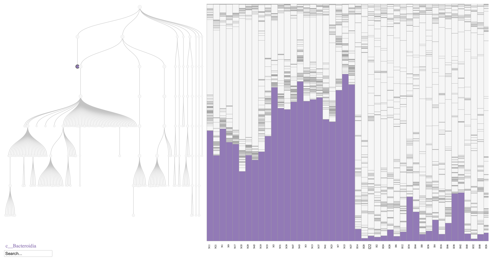
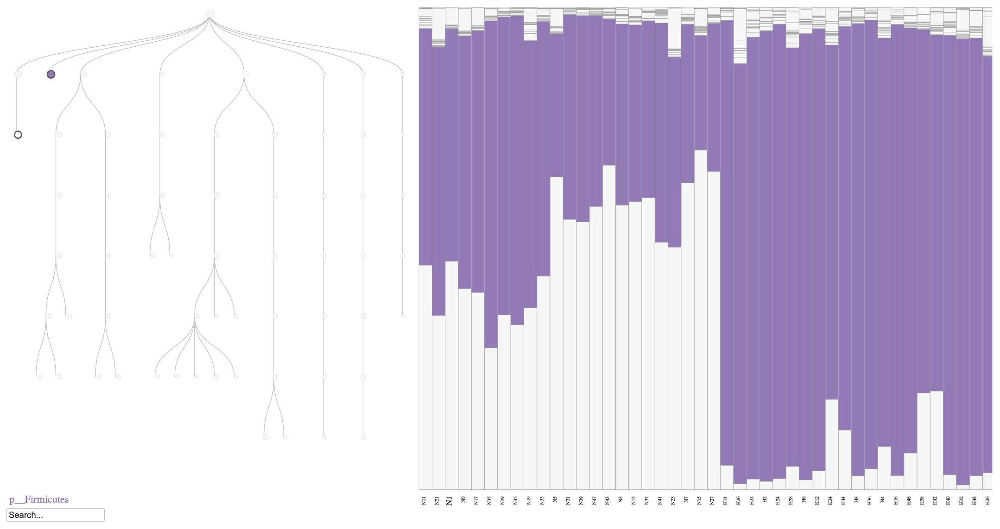
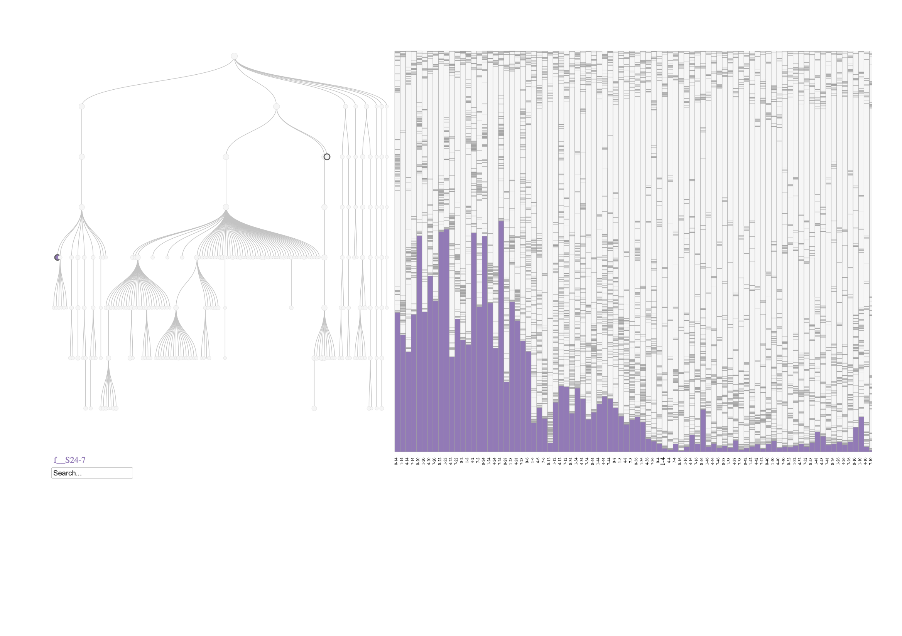

```{r knitr_options, include = FALSE}
knitr::opts_chunk$set(
    collapse = TRUE,
    comment = "#>",
    message = FALSE
)
```

# Overview

High-fat, high-sugar (HFHS) diets are known to profoundly alter the gut microbiome, influencing both microbial composition and functional capacity. As described by Susin et al. (2020), the effects of diet on the gut microbiome were evaluated in 47 C57BL/6 female mice. The mice were fed either an HFHS diet or a normal diet, and fecal samples were collected on days 0, 1, 4, and 7. Illumina MiSeq was used to generate 16S rRNA sequencing data, which were subsequently processed with QIIME 1.9.0. In this vignette, we use the preprocessed dataset from Kodikara et al. (2025). The dataset can be accessed through the GitHub repository of the `LUPINE` R package using the command `devtools::install_github("SarithaKodikara/LUPINE")`.

Here, we demonstrate how to apply the phylobar package to create phylogeny-aware visualizations of the HFHS diet study data. Specifically, we walk through tree construction and generate visualizations that reproduce key findings from previous studies, including decreased relative abundance of \textit{Bacteroidetes} but an increase in the relative abundance of \textit{Firmicutes} (Jo et al. 2021, Yang et al. 2024).

# Why phylogeny-aware plots?

Static stacked bar plots often hide changes that occur at specific taxonomic levels. Phylogeny-aware plots maintain hierarchical structure, so zooming to a level (for example, class Bacteroidia or family S24-7) lets you see whether shifts are local to a clade or spread across multiple branches. This supports exploratory analysis and helps decide which levels warrant downstream testing.

# Setup

The following code block loads the packages required for this analysis.
```{r setup}
library(phylobar)   # phylogeny-aware bar plots
library(LUPINE)     # HFHS example dataset
library(dplyr)      # data wrangling
library(ape)        # phylogenetic tree manipulation
library(stringr)    # string operations
```

Next, we load the HFHS dataset, which is stored in the LUPINE package as `HFHSdata`. This dataset is stored as a list and contains OTU tables for mice fed either a normal diet or an HFHS diet, along with the corresponding taxonomic annotations.

```{r data}
data(HFHSdata)
normal <- HFHSdata$OTUdata_Normal
hfhs <- HFHSdata$OTUdata_HFHS
taxa <- HFHSdata$filtered_taxonomy
```

# Taxonomy-based tree construction

We begin by constructing a taxonomy-based tree from the taxonomic annotations provided in the dataset. The `taxonomy_to_tree` function from the phylobar package is used to convert the taxonomic data into a phylogenetic tree structure.

```{r tree_construction}
tree <- taxa |>
    select(-X1, X1) |>
    mutate(
        across(
            everything(),
            ~if_else(str_ends(., "_"), NA, .)
        )
    ) |>
    taxonomy_to_tree()

checkValidPhylo(tree)
```

# Diet contrasts on day 7

To visualize the effect of diet on the mouse microbiome, we will focus on samples collected on day 7. These samples are expected to show the most pronounced differences between the normal diet and HFHS diet group (Kodikara et al. 2025).

We begin by extracting the relevant slices from the 3D arrays representing the OTU tables for both diet groups. We also rename the samples to indicate their diet group (N for normal diet and H for HFHS diet).

```{r ordering}
# Extract day 7 samples and rename
normal_day7 <- normal[,, 4]
rownames(normal_day7) <- str_replace(rownames(normal_day7), "M_", "N")
hfhs_day7 <- hfhs[,, 4]
rownames(hfhs_day7) <- str_replace(rownames(hfhs_day7), "M_", "H")
# Combine the two datasets
all_day7 <- rbind(normal_day7, hfhs_day7)

# Order samples and species using hierarchical clustering
comp_norm <- normal_day7
comp_norm <- comp_norm / rowSums(comp_norm)
sample_order1 <- hclust(dist(comp_norm))$order
species_order <- hclust(dist(t(comp_norm)))$order

# Now order the HFHS samples
comp_hfhs <- hfhs_day7
comp_hfhs <- comp_hfhs / rowSums(comp_hfhs)
sample_order2 <- hclust(dist(comp_hfhs))$order

# Combine the sample orders
sample_order <- c(rownames(normal_day7)[sample_order1], rownames(hfhs_day7)[sample_order2])

# Reorder the combined data
x <- all_day7[sample_order, species_order]
```


Finally we convert to compositions and visualize.

```{r visualize}
comp <- x / rowSums(x)
colnames(comp) <- colnames(all_day7)[species_order]
phylobar(comp, tree, hclust_order = FALSE, sample_font_size = 9)
```
Lets select Bacteroidia class from the dropdown and see the effect of diet on this class.


## Interpretation

```{r fig1, echo=FALSE, fig.align='center', fig.cap="Phylobar plot of the mouse microbiome on day 7, comparing normal diet (N) and HFHS diet (H). The plot highlights the relative abundances of Bacteroidia class, which is known to decrease in response to an HFHS diet."}

```

As shown in Figure \@ref(fig:fig1), the relative abundance of Bacteroidia decreases in the HFHS diet group compared to the normal diet group, consistent with previous findings (Jo et al. 2021, Yang et al. 2024). Similarly, we can visualize the Firmicutes phylum to observe its increase in relative abundance under the HFHS diet (Figure \@ref(fig:fig2)).

```{r fig2, echo=FALSE, fig.align='center', fig.cap="Phylobar plot of the mouse microbiome on day 7, comparing normal diet (N) and HFHS diet (H). The plot highlights the relative abundances of Firmicutes phylum, which is known to increase in response to an HFHS diet."}

```


# Longitudinal trajectories within HFHS

To explore longitudinal patterns in the HFHS diet group, we visualized samples collected on days 0, 1, 4, and 7. This allows us to track how the microbiome composition changes over time in response to the HFHS diet. Samples were deliberately sorted by mouse and time point, enabling us to observe within-mouse changes across the study period. This is important because the initial relative abundances can differ between mice, and aligning samples by individual helps highlight true longitudinal shifts.


```{r melt}
y <- hfhs[sample_order2, species_order, ] |>
    aperm(c(1, 3, 2)) |>
    matrix(nrow = nrow(hfhs)*dim(hfhs)[3] , ncol = ncol(hfhs))

rownames(y) <- apply(
    expand.grid(c(0, 1, 4, 7), str_replace(rownames(hfhs),"M_","")[sample_order2]),
    1, paste, collapse = "-"
)
```

We now convert to compositions and visualize the longitudinal data for the HFHS diet group.

```{r visualize_longitudinal}
comp <- y / rowSums(y)
colnames(comp) <- colnames(hfhs)[species_order]
phylobar(comp, tree, hclust_order = FALSE, sample_font_size = 9)

#p<-phylobar(comp, tree, hclust_order = FALSE, width=1200, height = 800, sample_font_size = 8)
#htmlwidgets::saveWidget(p, "interactive_scatter.html", selfcontained = TRUE)
```

## Interpretations

Even though the variability between mice is high, we can observe a general decrease in the relative abundance of the S24-7 family (within the Bacteroidetes phylum) over time in response to the HFHS diet (Figure \@ref(fig:fig3)). This pattern aligns with previous findings indicating that members of the S24-7 family are sensitive to dietary changes and tend to decrease in abundance under high-fat, high-sugar dietary conditions (Kodikara et al. 2025).

```{r fig3, echo=FALSE, fig.align='center', fig.cap="Phylobar plot of the mouse microbiome for HFHS diet. The plot highlights the relative abundances of S24-7 family that belong to the Bacteroidetes phylum, which is known to decrease over time in response to an HFHS diet."}

```

# Session Info

```{r session}
sessionInfo()
```